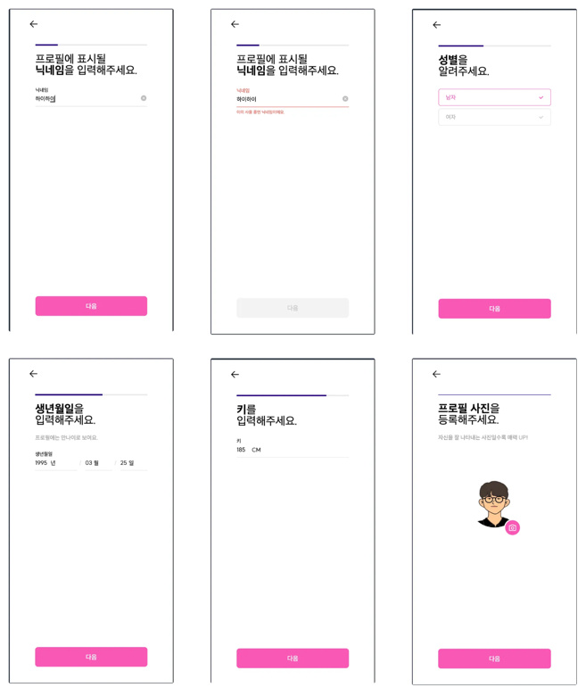

# 닉네임 선점 (중복검사를 수행하고 가입 버튼을 눌렀는데 중복되었다고?)

회원가입시 닉네임 중복검사 단계와 실제 저장 사이에 시간이 존재하는데, 이로 인해 다음과 같은 문제가 발생하였습니다.

1. **중복검사 통과 후 다른 사람이 가입**: 중복검사를 통과했지만 그 사이에 다른 사용자가 먼저 가입을 진행할 경우, 닉네임이 중복되어 본인이 선택한 닉네임을 사용할 수 없게 되는 현상이 발생합니다.
2. **사용되지 않는 닉네임이 이미 사용 중으로 표시**: 처음에는 `nickname`을 가지고 있는 `UserDetail` 엔티티를 먼저 저장하는 방식이 사용되었습니다. 이 방식에서는 닉네임이 실제로 사용되지 않았음에도 불구하고, 다른 사용자에게는 해당 닉네임이 이미 사용 중인 것처럼 보이게 되는 문제가 발생했습니다.
3. **중복검사 후 중도 이탈 시 문제**: 닉네임 중복검사를 완료한 후, 사용자가 가입 과정을 중단할 경우, 그 닉네임은 여전히 사용 중으로 간주되어 다른 사용자가 해당 닉네임을 사용할 수 없게 되는 현상이 발생했습니다.

### 해결 방법: Redis를 활용한 닉네임 선점 방지

이 문제를 해결하기 위해 **Redis**의 **expire 기능**을 활용하여, 닉네임 선점 문제를 해결할 수 있었습니다. 아래와 같은 방식으로 구현을 진행했습니다:

1. **Redis 키 설정**: 닉네임을 사용하려는 사용자에 대해 `nickname:userId` 형태의 키를 설정합니다. 이때, `userId`는 해당 닉네임을 사용하려는 사용자의 고유 ID를 나타냅니다.
2. **만료 시간 설정**: 이 키에는 20분의 만료 시간을 설정하여, 사용자가 가입을 완료하지 않거나 중도에 이탈한 경우 해당 닉네임이 자동으로 반환되도록 했습니다.
    - 예를 들어, 사용자가 닉네임을 입력하고 중복검사를 통과했다면, `<닉네임>:<userId>` 형태의 Redis 키가 설정되며, 이 키는 20분 후에 자동으로 만료되어 해당 닉네임을 다른 사용자가 사용할 수 있게 됩니다.
3. **중복검사 후 만료 시간 설정**: 실제로 사용자가 회원가입을 완료하면, Redis에 저장된 키와 값을 제거하여 닉네임을 정상적으로 사용자가 차지할 수 있도록 했습니다. 만약 20분 내에 가입이 완료되지 않으면, 다른 사용자가 동일한 닉네임을 사용할 수 있도록 하여 닉네임이 선점되는 문제를 방지했습니다.
